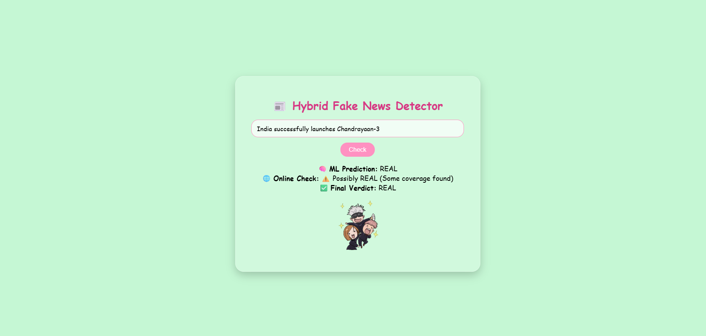
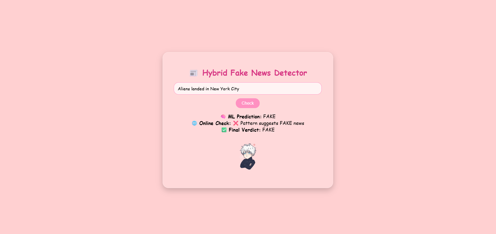

# 📰 Hybrid Fake News Detector

[](https://www.python.org/)
[](https://flask.palletsprojects.com/)
[](https://scikit-learn.org/)
[](https://opensource.org/licenses/MIT)

A powerful hybrid system that combines **Machine Learning** with **real-time online verification** to detect fake news.

---

## ✨ Features

- 🤖 **ML Prediction**: PassiveAggressiveClassifier with TF-IDF vectorization
- 🌐 **Online Verification**: Real-time news checking via NewsAPI
- 💾 **Smart Caching**: 6-hour cache to save API calls
- 🎭 **Animated UI**: Fun character animations (typing/idle/happy/angry)
- 🔄 **Multiple Fallbacks**: DuckDuckGo API + pattern matching
- 🔑 **Secure**: Environment variables for API key protection

---

## 📸 Screenshots

### Real News Detection


### Fake News Detection



---

## 🛠️ Tech Stack

| Category | Technologies |
|----------|-------------|
| Backend | Python, Flask, Flask-CORS |
| ML | scikit-learn, PassiveAggressiveClassifier, TF-IDF |
| Frontend | HTML5, CSS3, JavaScript |
| APIs | NewsAPI, DuckDuckGo API |
| Libraries | requests, BeautifulSoup4, python-dotenv, joblib |

---

## 📋 Prerequisites

- Python 3.8+
- NewsAPI key (free from [newsapi.org](https://newsapi.org/register))
- Git

---

## 🚀 Installation & Setup

### 1. Clone the Repository
```bash

git clone https://github.com/neutromax/Hybrid-fake-news-detector.git
cd Hybrid-fake-news-detector
```

### 2. Create Virtual Environment
```bash

# Create venv
python -m venv venv

# Activate - Windows
venv\Scripts\activate

# Activate - Mac/Linux
source venv/bin/activate
```

### 3. Install Dependencies
```bash

pip install -r requirements.txt
```
### 4. Get API Key

- Sign up at [newsapi.org](https://newsapi.org/register)
- Copy your API key

### 5. Setup Environment
Create `.env` file:
```bash

NEWS_API_KEY=your_api_key_here
```

### 6. Run Application
```bash

python backend.py
```

### 7. Open in Browser
```bash

http://localhost:5000
```

---

## 📁 Project Structure

```bash

Hybrid-fake-news-detector/
├── backend.py                # Flask app
├── online_checker.py         # NewsAPI + caching logic
├── requirements.txt          # Dependencies
├── .env                      # API keys (ignored by git
├── .gitignore                # Git ignore rules
├── screenshots/              # Screenshots folder
│   ├── real-news.png
│   ├── fake-news.png
│   ├── uncertain.png
│   └── character.gif
├── ml_model/
│   ├── model.pkl             # Trained classifier
│   └── tfidf.pkl             # TF-IDF vectorizer
├── frontend/
│   ├── index.html            # Main UI
│   └── gifs/                 # Animations
│       ├── idle.gif
│       ├── typing.gif
│       ├── happy.gif
│       ├── angry.gif
│       └── unsure.gif
└── cache/                    # Cached results
    └── *.json
```

---

## 🧠 How It Works

- **Input**: User enters headline
- **ML**: Model predicts FAKE/REAL
- **Online**: NewsAPI fetches related articles
- **Score**: Relevance calculation (0-1)
- **Verdict**:
  - >0.5 = REAL
  - 0.3-0.5 = Possibly REAL
  - <0.15 = FAKE
- **Output**: Shows result + sources

---

## 📊 Example Results

| Headline | ML | Online | Final |
|----------|-----|--------|-------|
| NASA discovers water on Mars | REAL | ✅ REAL | REAL |
| Elon Musk is richest man | FAKE | ✅ REAL | REAL |
| Aliens landed in NY | FAKE | ❌ FAKE | FAKE |
| 5G causes COVID-19 | FAKE | ❌ FAKE | FAKE |

---

## 🔮 Future Scope

- Source credibility scoring
- Multiple API fallbacks
- Sentiment analysis
- Fact-check API integration
- Browser extension
- Confidence meter
- Multi-language support

---

## 🤝 Contributing

1. Fork it
2. Create branch (`git checkout -b feature`)
3. Commit (`git commit -m 'Add feature'`)
4. Push (`git push origin feature`)
5. Open PR

---

## 📝 License

MIT License - see [LICENSE](LICENSE)

---

## 📬 Contact

**Neutromax** - [@github](https://github.com/neutromax)

Project: [https://github.com/neutromax/Hybrid-fake-news-detector](https://github.com/neutromax/Hybrid-fake-news-detector)

---

⭐ **Star this repo if you found it useful!**
